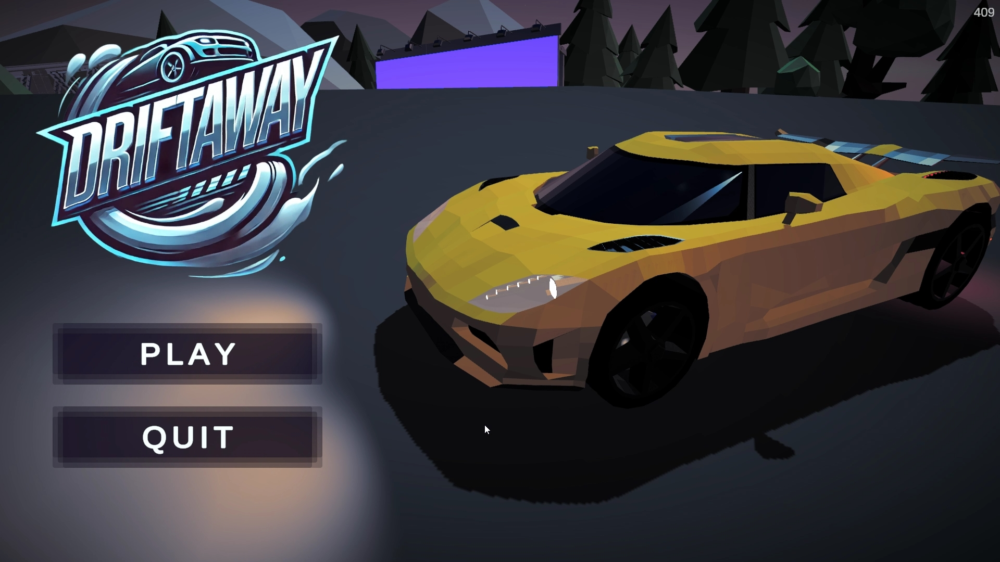
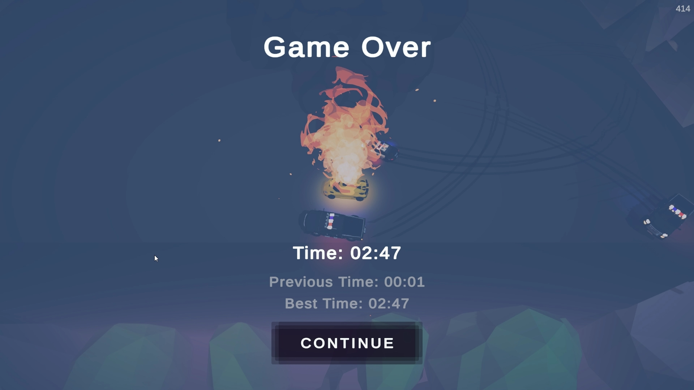

# Driftaway
**DriftAway** is an endless arcade racing game where you control a car trying to escape the police. Set on a small island, the objective is to dodge police cars and avoid obstacles while drifting at high speeds. The longer you survive, the more intense the chase becomes. Can you outrun the law and master the art of drifting?

## Play Now
You can play **Driftaway** in a browser on [Itch.io](https://skal3.itch.io/driftaway).

## About project
This is my first game made in Unity, although I primarily work with UE (or without engine) as a C++ developer. I also created the **Koenigsegg 3D model** (player car).
I was inspired by Limbo Drift by [ShibaDog Studios](https://www.youtube.com/@ShibaDogStudios), and aimed to craft a unique style and gameplay experience, adding my own twist to the drifting mechanics and game features.

## How to Play
- Use arrow keys or WASD to steer and accelerate.
- Avoid collisions with enemy vehicles.
- Survive as long as you can!

## Showcase

